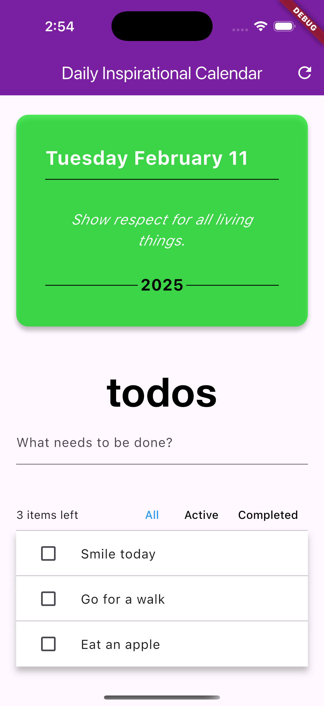

# Flutter Inspirational Calendar

A Flutter-based inspirational calendar application for Android, iOS, and macOS.

## About the Project

This project is an inspirational calendar app built using Flutter. It provides daily inspirational quotes or messages across multiple platforms including Android, iOS, and macOS.

It also shows how to use Riverpod with the example in the riverpod docs of using a todos list.

## Getting Started

To get started with this project:

1. Ensure you have Flutter installed on your development machine.
2. Clone this repository.
3. Run `flutter pub get` to install dependencies.
4. Use `flutter run` to launch the app on your desired platform (Android, iOS, or macOS).

## Features

- Daily inspirational quotes or messages to keep you motivated.
- ToDos list to manage your daily activities and reminders